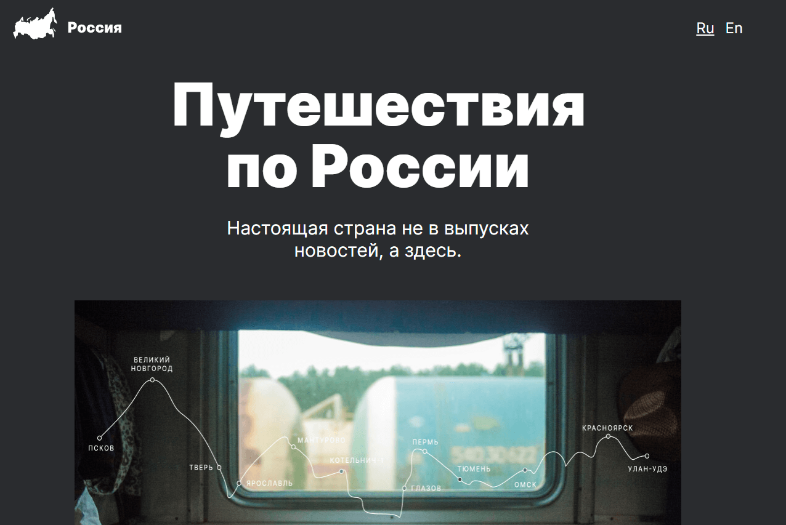

# [Путешествия по России](https://dmitriyledovskih.github.io/russian-travel/)

## Описание:

Вторая проектная работа про путешествия по России от [Яндекс.Практикума](https://practicum.yandex.ru/).

Адаптивный сайт о путешествие по России на поезде.

Я сверстал макет из фигмы, и сделал адаптив.

## Обложка

## В проекте используются:

1. Семантические теги
2. Наименования классов по БЭМ
3. Файловая структура БЭМ Nested
4. Flexbox
5. Grid
6. Адаптив

## Планы:

- [ ] Добавить анимации
- [ ] Сделать английскую версию сайта
